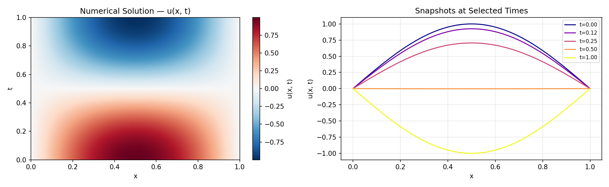

# Physics-Informed Neural Networks — 1D Wave Equation

A clean, beginner-friendly implementation of a **Physics-Informed Neural Network (PINN)**
applied to the **1D wave equation**.  
The project is self-contained, runs end-to-end on a laptop CPU in minutes, and is
structured to be easy to read, extend, and experiment with.

---

## Table of Contents

1. [What Is a PINN?](#what-is-a-pinn)
2. [Mathematical Problem](#mathematical-problem)
3. [How Synthetic Data Is Generated](#how-synthetic-data-is-generated)
4. [Loss Function](#loss-function)
5. [Architecture](#architecture)
6. [Project Structure](#project-structure)
7. [Installation](#installation)
8. [Running the Project](#running-the-project)
9. [Expected Outputs](#expected-outputs)
10. [Results](#results)
11. [File Descriptions](#file-descriptions)
12. [Possible Extensions](#possible-extensions)
13. [Troubleshooting](#troubleshooting)
14. [Background: Why PINNs Work](#background-why-pinns-work)
15. [References](#references)

---

## What Is a PINN?

A **Physics-Informed Neural Network** is a standard feedforward neural network
trained with **two kinds of supervision simultaneously**:

| Supervision | Source | Purpose |
|---|---|---|
| **Data loss** | Numerical or experimental measurements | Fit known data points |
| **Physics loss** | Governing PDE, evaluated via automatic differentiation | Enforce the PDE everywhere in the domain |

The total training objective is:

```
L = λ_data · L_data  +  λ_phys · L_phys  +  λ_bc · L_bc  +  λ_ic · L_ic
```

Instead of discretising the PDE on a grid (as finite differences or FEM do), the
PINN learns a smooth continuous function `u(x, t)` whose derivatives satisfy the
equation. This means the network can be queried at **any** `(x, t)` point, not
just grid nodes.

---

## Mathematical Problem

We solve the classical **1D wave equation**:

```
∂²u/∂t²  =  c² · ∂²u/∂x²         x ∈ [0, 1],  t ∈ [0, 1]
```

with the following conditions:

| Condition | Expression | Meaning |
|---|---|---|
| Initial displacement | `u(x, 0) = sin(πx)` | String plucked into a sinusoidal shape |
| Initial velocity | `∂u/∂t (x, 0) = 0` | Released from rest |
| Left boundary | `u(0, t) = 0` | Left end fixed |
| Right boundary | `u(1, t) = 0` | Right end fixed |

**Wave speed:** `c = 1.0`

**Analytical solution** (used for verification):

```
u(x, t) = sin(πx) · cos(c · π · t)
```

This describes a **standing wave** that oscillates in time without dissipation or
dispersion — a perfect test case because the analytical answer is known.

---

## How Synthetic Data Is Generated

Because no experimental data exist, we first solve the PDE numerically using an
**explicit finite-difference leapfrog scheme**.

### Leapfrog Update Formula

```
u[n+1, i] = 2·u[n,i] − u[n−1,i] + r² · (u[n,i+1] − 2·u[n,i] + u[n,i−1])
```

where `r = c·Δt/Δx` is the **CFL number** (must satisfy `r ≤ 1` for stability).

### Grid Parameters (defaults)

| Parameter | Symbol | Value |
|---|---|---|
| Spatial points | `NX` | 200 |
| Temporal points | `NT` | 500 |
| Spatial step | `Δx` | `1/(NX−1)` |
| Temporal step | `Δt` | `1/(NT−1)` |
| CFL number | `r` | `c·Δt/Δx ≈ 0.40` |

The solver produces a `(NT × NX)` array `U[t, x]` that acts as our "ground truth"
reference. This array is saved to `data/raw/wave_solution.npz`.

---

## Loss Function

### Four Loss Components

| Term | Formula | Weight (default) | Purpose |
|---|---|---|---|
| `L_data` | `MSE(u_pred, u_numerical)` | `λ_data = 1.0` | Fit the sampled numerical data |
| `L_phys` | `MSE(u_tt − c²·u_xx, 0)` | `λ_phys = 1.0` | Satisfy the wave PDE |
| `L_bc` | `MSE(u(0,t), 0) + MSE(u(1,t), 0)` | `λ_bc = 10.0` | Enforce Dirichlet walls |
| `L_ic` | `MSE(u(x,0), sin(πx)) + MSE(u_t(x,0), 0)` | `λ_ic = 10.0` | Enforce both initial conditions |

Boundary and initial conditions are weighted ×10 higher than the interior losses
to enforce hard constraints more strongly.

### Collocation Strategy

| Point set | Count (default) | How sampled |
|---|---|---|
| Data points | 2 000 | Random interior grid indices |
| Collocation (physics) | 5 000 | Uniform random in `(x,t)` — **not** tied to the FD grid |
| BC points | 500 per wall | Uniform random `t ∈ [0,1]` at `x=0` and `x=1` |
| IC points | 500 | Uniform random `x ∈ [0,1]` at `t=0` |

---

## Architecture

```
Input  (x, t) ──► Linear(2→64)──Tanh ──► [×4 Linear(64→64)──Tanh] ──► Linear(64→1) ──► u(x,t)
```

| Hyperparameter | Value |
|---|---|
| Input dimension | 2 (`x`, `t`) |
| Hidden layers | 5 |
| Width per layer | 64 neurons |
| Activation | Tanh (infinitely differentiable — essential for 2nd-order PDEs) |
| Output | 1 scalar `u(x,t)` |
| Weight init | Xavier uniform |
| Trainable params | ~21 000 |

**Why Tanh?** The physics loss requires `∂²u/∂t²` and `∂²u/∂x²` via autograd.
ReLU's second derivative is zero almost everywhere and produces garbage gradients.
Tanh is smooth to all orders.

---

## Project Structure

```
physics-informed-neural-networks-basics/
│
├── README.md                   ← this file
├── requirements.txt            ← pip dependencies
├── config.py                   ← all hyperparameters and paths (edit here)
├── main.py                     ← end-to-end pipeline entry point
├── .gitignore
│
├── src/                        ← library modules (importable package)
│   ├── __init__.py
│   ├── data_generator.py       ← finite-difference solver + save/load
│   ├── dataset.py              ← sampling: data, collocation, IC, BC tensors
│   ├── model.py                ← PINN architecture + autograd derivatives
│   ├── losses.py               ← four loss terms + weighted total
│   ├── train.py                ← Adam training loop + LR scheduler + CSV log
│   ├── evaluate.py             ← MSE / MAE / Rel-L2 metrics
│   ├── utils.py                ← seeds, device selection, directory creation
│   └── plots.py                ← all Matplotlib figure generation
│
├── notebooks/                  ← interactive exploration (optional)
│
├── tests/                      ← unit tests (optional)
│
├── data/
│   ├── raw/
│   │   └── wave_solution.npz   ← generated after first run (gitignored)
│   └── processed/              ← reserved for derived datasets
│
└── outputs/
    ├── figures/                ← saved plots (PNG, 150 dpi)
    ├── models/                 ← trained checkpoint — pinn_wave.pth
    └── logs/                   ← loss_history.csv
```

---

## Installation

### Prerequisites

- Python 3.9+
- `pip`

### Steps

```bash
# 1. Clone the repository
git clone https://github.com/MBJamshidi/physics-informed-neural-networks-basics.git
cd physics-informed-neural-networks-basics

# 2. Create and activate a virtual environment (recommended)
python -m venv venv

# Windows
venv\Scripts\activate

# macOS / Linux
source venv/bin/activate

# 3. Install dependencies
pip install -r requirements.txt
```

> **GPU (optional):** if you have a CUDA-capable GPU, install the matching
> `torch` version from [pytorch.org](https://pytorch.org/get-started/locally/).
> The code auto-detects CUDA; otherwise it falls back to CPU.

---

## Running the Project

### Full pipeline — recommended first run

```bash
python main.py
```

What happens:
1. Solves the wave equation with finite differences → `data/raw/wave_solution.npz`
2. Plots the numerical reference solution → `outputs/figures/numerical_solution.png`
3. Trains the PINN for 8 000 epochs (~5–10 min on CPU)
4. Saves the model checkpoint → `outputs/models/pinn_wave.pth`
5. Saves all comparison figures → `outputs/figures/`
6. Prints evaluation metrics (MSE, MAE, Rel-L2)

### Command-line options

| Flag | Type | Default | Effect |
|---|---|---|---|
| `--epochs N` | int | 8000 | Override number of training epochs |
| `--lr LR` | float | 1e-3 | Override Adam learning rate |
| `--seed S` | int | 42 | Override random seed |
| `--skip-datagen` | flag | off | Skip numerical solve, reuse existing `.npz` |

**Examples:**

```bash
# Quick smoke-test (< 1 minute)
python main.py --epochs 500

# Reuse dataset, change learning rate
python main.py --skip-datagen --lr 5e-4

# Reproducibility with a different seed
python main.py --seed 7
```

---

## Expected Outputs

After a full run you will find the following files:

| File | Description |
|---|---|
| `outputs/figures/numerical_solution.png` | Heatmap + time-slice snapshots of the finite-difference solution |
| `outputs/figures/loss_history.png` | Total and per-component loss curves (log scale) |
| `outputs/figures/comparison_heatmaps.png` | Side-by-side: reference \| PINN \| absolute error |
| `outputs/figures/snapshots.png` | `u(x)` profiles at 4 time slices — numerical vs PINN |
| `outputs/models/pinn_wave.pth` | Trained model weights (PyTorch state dict) |
| `outputs/logs/loss_history.csv` | Epoch-by-epoch loss values |
| `data/raw/wave_solution.npz` | Compressed numerical solution array |

---

## Results

A sample numerical solution produced by the finite-difference solver:



After training, the PINN matches the reference closely across the full
space-time domain, with a relative L2 error typically below **1 %** after
8 000 Adam epochs.

---

## File Descriptions

### Root

| File | Role |
|---|---|
| `config.py` | Single source of truth for **all** settings. Modify `EPOCHS`, `LEARNING_RATE`, grid sizes, loss weights here — never hunt through source files. |
| `main.py` | Orchestrates the full workflow: data → train → evaluate → plot. Exposes a `--skip-datagen` flag and overrides for `--epochs`, `--lr`, `--seed`. |
| `requirements.txt` | Minimal pip dependencies. |

### `src/`

| Module | Role |
|---|---|
| `data_generator.py` | Implements the explicit leapfrog finite-difference solver. Validates CFL stability. Saves and loads the solution in compressed `.npz` format. |
| `dataset.py` | Converts the solution grid into PyTorch tensors. Samples data points, collocation points, IC points, and BC points. All tensors that need autograd have `requires_grad=True`. |
| `model.py` | Defines the `PINN` class (fully connected, Tanh). Provides the `grad()` helper and `compute_pde_residual()` / `compute_ic_velocity()` functions that use autograd for second-order derivatives. |
| `losses.py` | Implements `data_loss`, `physics_loss`, `bc_loss`, `ic_loss`, and `total_loss`. All four terms are MSE-based. |
| `train.py` | Adam training loop with `ReduceLROnPlateau` scheduling. Logs losses to CSV every epoch; prints a table every `LOG_EVERY` epochs; saves the final checkpoint. |
| `evaluate.py` | Runs the trained model over the full `(NT × NX)` grid and computes MSE, MAE, and relative L2 error vs the numerical reference. |
| `plots.py` | Generates four figures using Matplotlib (Agg backend — safe for headless servers). |
| `utils.py` | Seeds Python / NumPy / PyTorch for reproducibility; selects device; creates output directories; counts trainable parameters. |

---

## Possible Extensions

| Idea | Where to start |
|---|---|
| **Add damping** | Modify PDE to `u_tt + β·u_t = c²·u_xx` — add a `u_t` term in `compute_pde_residual` |
| **Different initial conditions** | Change `U[0, :]` in `data_generator.py` and update `U_ic` in `dataset.py` |
| **Larger domain / longer time** | Increase `T_MAX`, `NX`, or `NT` in `config.py` |
| **L-BFGS fine-tuning** | Add a second optimizer phase in `train.py` after Adam converges |
| **2D wave equation** | Extend input to `(x, y, t)` and add y-boundary conditions |
| **Noisy training data** | Add Gaussian noise to `U` in `dataset.py` before sampling |
| **Adaptive collocation (RAR)** | Resample collocation points where the PDE residual is largest |
| **Hard boundary enforcement** | Multiply network output by `x·(1-x)·t` so BCs are satisfied by construction |
| **Transfer learning** | Pretrain on one PDE, fine-tune on a slightly different one |

---

## Troubleshooting

| Symptom | Likely cause | Fix |
|---|---|---|
| `CFL number > 1` error | `NT` too small relative to `NX` | Increase `NT` or decrease `NX` in `config.py` |
| Training very slow | `N_COLLOC_POINTS` drives autograd cost | Reduce to 2 000 or use `--epochs 1000` |
| Loss stagnates early | Learning rate too high | Try `--lr 5e-4` or increase `LAMBDA_IC` |
| CUDA out of memory | Unlikely on this small model | Reduce `N_COLLOC_POINTS` |
| `ModuleNotFoundError: No module named 'src'` | Running from wrong directory | Run `python main.py` from the **project root**, not from inside `src/` |
| Plots not appearing | Agg backend is non-interactive | Plots are saved to `outputs/figures/` — open them there |

---

## Background: Why PINNs Work

> A neural network is a universal function approximator — given enough capacity
> and training, it can represent almost any smooth function.
>
> Here we want it to represent `u(x, t)`, the displacement of a vibrating string.
> Normally you would train by showing the network many `(input, output)` pairs.
>
> A PINN does something extra: it also evaluates the **derivatives of its own
> output** (via automatic differentiation) and checks whether they satisfy the
> wave equation `u_tt = c²·u_xx`. If they don't, the network is penalised.
>
> The result is a solution that is:
> - consistent with observed data (data loss),
> - physically plausible everywhere in the domain (physics loss),
> - and anchored at the boundaries and initial state (BC/IC losses).
>
> In regions where we have **no data at all**, the physics constraint fills the
> gap — the PINN interpolates in a physically meaningful way rather than
> arbitrarily.

---

## References

- Raissi, M., Perdikaris, P., & Karniadakis, G. E. (2019).
  **Physics-informed neural networks: A deep learning framework for solving
  forward and inverse problems involving nonlinear partial differential equations.**
  *Journal of Computational Physics*, 378, 686–707.
  [doi:10.1016/j.jcp.2018.10.045](https://doi.org/10.1016/j.jcp.2018.10.045)

- Karniadakis, G. E., Kevrekidis, I. G., Lu, L., Perdikaris, P., Wang, S., &
  Yang, L. (2021).
  **Physics-informed machine learning.**
  *Nature Reviews Physics*, 3(6), 422–440.
  [doi:10.1038/s42254-021-00314-5](https://doi.org/10.1038/s42254-021-00314-5)

- PyTorch documentation — [pytorch.org/docs](https://pytorch.org/docs/stable/)

- LeVeque, R. J. (2007).
  **Finite Difference Methods for Ordinary and Partial Differential Equations.**
  SIAM. *(CFL stability analysis, leapfrog scheme.)*
